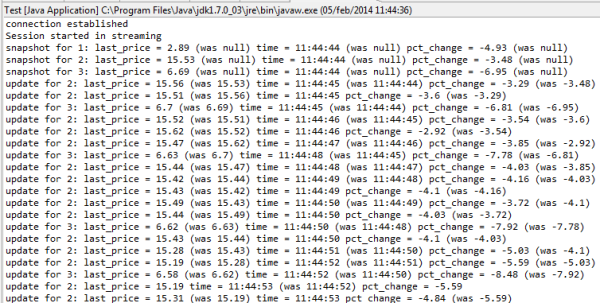

# Lightstreamer - Quickstart Example - Java SE Client 

The *Quickstart Example* provides the source code to build very simple and basic client applications, used to test the capability of the Client APIs to connect and receive data from Lightstreamer Server. The examples can be used to familiarize with the Client APIs and as a reference on how to use them, and can be used as a starting point for client application implementations.

This project contains the Java source files of some sample applications, that shows how the [Lightstreamer Java SE Client API](http://docs.lightstreamer.com/api/ls-javase-client/latest/) can be used to connect to Lightstreamer Server.


## Details

The [Lightstreamer Java SE Client API](http://www.lightstreamer.com/docs/client_javase_uni_api/index.html) is used to connect to Lightstreamer, subscribe to available
items and to send messages to the server. Automatic reconnections and resubscriptions are offered out-of-the-box by the library itself. All the available methods are 
non-blocking so they execute fast, network and other time-consuming operations are handled on dedicated threads; methods are synchronized among themselves though, so 
calling many methods on the same instance from different threads at the same time might still slow down things a bit. 

### Dig the Code

Each source class (excluding the SystemOutClientListener) is an independent application with its own main() method. 
They basically connect to the server and perform a subscription, printing on the console the incoming Item Updates.

under src/quickstart you'll find: 
* `SystemOutClientListener.java` is a simple implementation of the ClientListener interface that is used by the other examples. An instance of this class, listening to
a LightstreamerClient instance (through the addListener method) will print on the standard output informations about the status of the connection.
* `Stocklist.java` is a simple application that subscribes to 15 stocks (MERGE) and prints all the updates on the standard output
* `Portfolio.java` is very similar to the `Stocklist.java` example, but, in this case a 2-level subscription, representing a portfolio (COMMAND) is shown. The second level is 
obtained using the same stock data (MERGE) used by the previous example.
* `Chat.java` is a simple application that subscribes to the chat item (DISTINCT) on a Lightstreamer server and then accepts command from the standard input to send messages, 
connect/disconnect subscribe/unsubscribe and others making it possible to easily experiment with the APIs




## Build

To build and install a version of this demo you have two options: either use [Maven](https://maven.apache.org/) (or other build tools) to take care of dependencies and building (recommended) or gather the necessary jars yourself and build it manually. For the sake of simplicity only the maven case is detailed here.

In both cases, if you plan to point the examples to your own server, you'll need to install the following adapters (depending on which quickstart example
you want to run you might not need them all):
* The *CHAT_ROOM* (see the [Lightstreamer - Stock-List Demo - Java Adapter](https://github.com/Lightstreamer/Lightstreamer-example-Chat-adapter-java)). 
* The *QUOTE_ADAPTER* (see the [Lightstreamer - Stock-List Demo - Java Adapter](https://github.com/Lightstreamer/Lightstreamer-example-StockList-adapter-java)) 
* The *PORTFOLIO_ADAPTER* ( see the [Lightstreamer - Portfolio Demo - Java Adapter](https://github.com/Lightstreamer/Lightstreamer-example-Portfolio-adapter-java)), 

Follow the instructions on those projects to get them up and running (in the portfolio case, you'll need the *full version*).

###Maven

You can easily build and run this application using Maven through the pom.xml file located in the root folder of this project.As an alternative, you can use an alternative build tool (e.g. Gradle, Ivy, etc.) by converting the provided pom.xml file.

Assuming Maven is installed and available in your path you can build the demo by running
```sh
mvn package
```

You can also run the application with the following command
```sh
mvn exec:java -Dexec.args="chat http://push.lightstreamer.com"
```
the arguments in the above command select the example to run (and must be either "chat", "stocklist" or "portfolio") and the target Lightstreamer server

## See Also 

### Lightstreamer Adapters Needed by This Client 

* [Lightstreamer - Stock-List Demo - Java Adapter](https://github.com/Lightstreamer/Lightstreamer-example-Stocklist-adapter-java)
* [Lightstreamer - Portfolio Demo - Java Adapter](https://github.com/Lightstreamer/Lightstreamer-example-Portfolio-adapter-java)
* [Lightstreamer - Chat Demo - Java Adapter](https://github.com/Lightstreamer/Lightstreamer-example-Chat-adapter-java)
* [Lightstreamer - Reusable Metadata Adapters - Java Adapter](https://github.com/Lightstreamer/Lightstreamer-example-ReusableMetadata-adapter-java)

### Related Projects

* [Lightstreamer - Basic Stock-List Demo - Java SE (Swing) Client](https://github.com/Lightstreamer/Lightstreamer-example-StockList-client-java)

## Lightstreamer Compatibility Notes 

- Compatible with Lightstreamer Java SE Client API v. 4.0 or newer.
- For Lightstreamer Allegro (+ Java SE Client API), Presto, Vivace.
- For a version of this example compatible with Lightstreamer Java Client API version 3.x, please refer to [this tag](https://github.com/Lightstreamer/Lightstreamer-example-Quickstart-client-java/tree/latest-for-client-3.x).
- For a version of this example compatible with Lightstreamer Java Client API version 2.5.2, please refer to [this tag](https://github.com/Lightstreamer/Lightstreamer-example-Quickstart-client-java/tree/latest-for-client-2.x).
